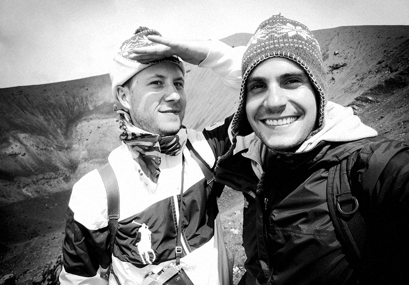

Animotor 
Lagerplatz 6 
8400 Winterthur 
[info@animotor.ch](mailto:info@animotor.ch)

Stephan Geiger 
[stephan@animotor.ch](mailto:stephan@animotor.ch) 
[+41 79 533 23 94](tel:+41795332394)

Pablo Hintermüller 
[pablo@animotor.ch](mailto:pablo@animotor.ch) 
[+41 76 463 66 95](tel:+41764636695)

# We are

a collaborative graphic design studio. Since small children we wanted to be rockstars and athletes, well now we are rocking computers and have sporty brains. We are fascinated by the power of shapes, stories and moving images. In these fields we feel home and we love to push our imagination to the next level. In close cooperation with our clients, we develop concepts and create products in the wide field of visual matters.

# We love

beats and barbeques, browsers and bowser, cats and dogs, eazy-e and easy ease, fonts and croissants, hi-res and wellness, hot tubs and lap tops, ice tea and 3-D, internet and cigarettes, kobe and adobe, movies and nights, ping pong and shows, rooftops and raves, sun and bathing, screens and prints, sandwiches and languages, space and cakes, sneakers and speakers, vinyls and semifinals, thursdays and birthdays, super mario and rio di janeiro, paper and skyscrapers, vacation and playstation, virtual and reality

# We do

advertising, animation, concept art, branding, editorial design, infographics, illustration, explainer-videos, web design, zumba lessons

- [Vimeo](https://vimeo.com/animotorstudio) 
- [Instagram](http://instagram.com/animotor_studio)
